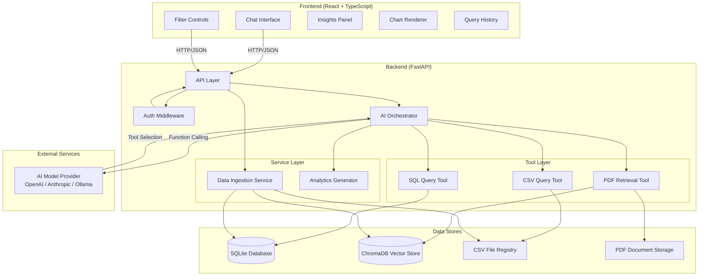

# AI Insights Assistant

A secure, full-stack AI-powered analytics assistant for a fictional entertainment company. Ask natural-language business questions and get answers drawn from SQL databases, PDF reports, and CSV files — with source attribution, charts, and actionable insights.

## Architecture Overview

The system follows a **tool-based AI orchestration** pattern. The AI model never accesses raw data directly — it selects and invokes discrete backend tools that query SQL databases, retrieve PDF passages, and filter CSV files. Every response includes source attribution for explainability.



### Request Flow

1. User submits a question (with optional filters) via the chat UI
2. Frontend sends an authenticated `POST /api/chat` request
3. Backend validates the JWT token and sanitizes input
4. The **Orchestrator** sends the question to the AI model with tool definitions
5. The AI model selects tools and the Orchestrator executes them in a loop
6. Tool results are fed back to the AI model for synthesis
7. The final response includes the answer, source attribution, chart data, insights, and a tool trace
8. Frontend renders the answer with markdown, charts, and the insights panel

## Technology Stack

| Layer | Technology | Purpose |
|-------|-----------|---------|
| **Backend** | Python 3.11+, FastAPI, Uvicorn | Async API server with auto-generated docs |
| **SQL Database** | SQLite via SQLAlchemy | Zero-config relational database |
| **Vector Store** | ChromaDB (embedded) | Semantic search over PDF chunks |
| **PDF Processing** | PyMuPDF (fitz) | Text extraction from PDF documents |
| **AI Model** | OpenAI API (configurable) | Function-calling LLM for orchestration |
| **Frontend** | React 19, TypeScript, Vite | Component-based SPA |
| **Charts** | Recharts | Bar, line, and pie chart rendering |
| **Markdown** | react-markdown | Rich text rendering in chat |
| **Auth** | JWT (PyJWT) | Stateless token authentication |
| **Infrastructure** | Docker, Docker Compose, nginx | Containerized multi-service deployment |

## Project Structure

```
├── backend/
│   ├── Dockerfile
│   ├── requirements.txt
│   └── app/
│       ├── main.py                  # FastAPI app entry point
│       ├── startup.py               # Seed data loading on startup
│       ├── api/
│       │   ├── auth_routes.py       # POST /api/auth/login
│       │   ├── chat_routes.py       # POST /api/chat, GET /api/chat/history
│       │   ├── data_routes.py       # GET /api/data/sources
│       │   ├── health_routes.py     # GET /api/health
│       │   ├── ingest_routes.py     # CSV/PDF ingestion endpoints
│       │   ├── middleware.py        # Correlation ID middleware
│       │   └── error_handlers.py    # Centralized exception handlers
│       ├── auth/
│       │   ├── service.py           # JWT token creation/validation
│       │   └── dependencies.py      # FastAPI auth dependency
│       ├── config/
│       │   └── settings.py          # Environment-based configuration
│       ├── models/
│       │   ├── database.py          # SQLAlchemy engine and session
│       │   ├── tables.py            # ORM table definitions
│       │   ├── requests.py          # Pydantic request models
│       │   ├── responses.py         # Pydantic response models
│       │   └── errors.py            # Custom exception classes
│       ├── orchestrator/
│       │   ├── orchestrator.py      # AI tool-calling loop
│       │   └── model_provider.py    # OpenAI-compatible provider
│       ├── services/
│       │   ├── ingestion.py         # CSV/PDF data ingestion
│       │   └── analytics.py         # Chart data and insights extraction
│       ├── tools/
│       │   ├── base.py              # Tool protocol interface
│       │   ├── sql_tool.py          # SQL query execution
│       │   ├── pdf_tool.py          # PDF semantic search
│       │   └── csv_tool.py          # CSV filtering and aggregation
│       └── utils/
│           └── sanitize.py          # Input sanitization
├── frontend/
│   ├── Dockerfile
│   ├── nginx.conf
│   ├── package.json
│   └── src/
│       ├── App.tsx                  # Main layout and state management
│       ├── main.tsx                 # React entry point
│       ├── api/
│       │   └── client.ts            # API client (login, chat, history)
│       ├── components/
│       │   ├── ChatInterface/       # Chat input and message thread
│       │   ├── ChartRenderer/       # Recharts bar/line/pie rendering
│       │   ├── FilterPanel/         # Time, genre, region filters
│       │   ├── InsightsPanel/       # Key metrics and recommendations
│       │   └── QueryHistory/        # Session query list with tool trace
│       ├── contexts/
│       │   └── AuthContext.tsx       # JWT auth provider
│       └── types/
│           └── index.ts             # TypeScript interfaces
├── data/
│   ├── generate_csv.py              # Sample CSV data generator
│   ├── generate_pdfs.py             # Sample PDF document generator
│   ├── csv/                         # Generated CSV seed files
│   └── pdfs/                        # Generated PDF documents
├── docker-compose.yml
├── .env.example
└── README.md
```

## Setup Instructions

### Prerequisites

- **Python 3.11+**
- **Node.js 20+** and npm
- **OpenAI API key** (or compatible provider)

### Local Development

**1. Generate sample data** (if not already present):

```bash
cd data
python generate_csv.py
python generate_pdfs.py
cd ..
```

**2. Configure environment variables**:

```bash
cp .env.example .env
```

Edit `.env` and set your API key. For Google Gemini (default):
```
GEMINI_API_KEY=your-gemini-api-key
```

**3. Set up the backend**:

```bash
cd backend
python -m venv .venv
source .venv/bin/activate    # On Windows: .venv\Scripts\activate
pip install -r requirements.txt
```

Start the backend server (from the `backend/` directory):

```bash
.venv/bin/uvicorn app.main:app --reload --port 8000 --env-file ../.env
```

The backend will automatically create the SQLite database, ingest CSV seed files, and index PDF documents on startup. API docs are available at [http://localhost:8000/docs](http://localhost:8000/docs).

**3. Set up the frontend**:

```bash
cd frontend
npm install
npm run dev
```

The frontend will be available at [http://localhost:5173](http://localhost:5173).

### Docker Setup

The simplest way to run the full stack:

```bash
# Copy and configure environment variables
cp .env.example .env
# Edit .env and set your OPENAI_API_KEY

# Build and start all services
docker compose up --build
```

| Service | URL |
|---------|-----|
| Frontend | [http://localhost:3000](http://localhost:3000) |
| Backend API | [http://localhost:8000](http://localhost:8000) |
| API Docs | [http://localhost:8000/docs](http://localhost:8000/docs) |

## Environment Variables

| Variable | Default | Description |
|----------|---------|-------------|
| `MODEL_PROVIDER` | `gemini` | AI provider to use: `openai`, `gemini`, or any OpenAI-compatible service |
| `MODEL_NAME` | `gemini-2.5-flash` | AI model name (e.g. `gpt-4o`, `gemini-2.5-flash`) |
| `OPENAI_API_KEY` | | API key when using OpenAI |
| `GEMINI_API_KEY` | | API key when using Google Gemini (from [AI Studio](https://aistudio.google.com/apikey)) |
| `OPENAI_BASE_URL` | | Custom base URL for other OpenAI-compatible providers (e.g. Ollama) |
| `JWT_SECRET` | `change-me-in-production` | Secret key for signing JWT tokens |
| `DEBUG` | `false` | Enable debug mode and verbose logging |
| `DATABASE_PATH` | `../data/app.db` | Path to the SQLite database file |
| `DATA_DIR` | `../data` | Root directory for data files |
| `PDF_STORAGE_DIR` | `../data/pdfs` | Directory containing PDF documents |
| `CSV_STORAGE_DIR` | `../data/csv` | Directory containing CSV files |
| `CHROMA_PERSIST_DIR` | `../data/chroma` | ChromaDB persistence directory |

## Switching AI Model Providers

The system supports multiple AI providers through a single OpenAI-compatible interface. Switch providers by changing environment variables in `.env` — no code changes needed.

### Google Gemini (default)

```env
MODEL_PROVIDER=gemini
MODEL_NAME=gemini-2.5-flash
GEMINI_API_KEY=your-gemini-api-key
```

Get your API key from [Google AI Studio](https://aistudio.google.com/apikey).

### OpenAI

```env
MODEL_PROVIDER=openai
MODEL_NAME=gpt-4o
OPENAI_API_KEY=sk-your-openai-key
```

### Ollama (local)

```env
MODEL_PROVIDER=openai
MODEL_NAME=llama3
OPENAI_API_KEY=ollama
OPENAI_BASE_URL=http://localhost:11434/v1/
```

### Any OpenAI-compatible provider

```env
MODEL_PROVIDER=openai
MODEL_NAME=your-model-name
OPENAI_API_KEY=your-api-key
OPENAI_BASE_URL=https://your-provider.com/v1/
```

The provider abstraction uses the OpenAI client library under the hood. For Gemini, it points to Google's OpenAI-compatible endpoint automatically. For other providers, set `OPENAI_BASE_URL` to their endpoint.

## API Endpoints

| Method | Path | Auth | Description |
|--------|------|------|-------------|
| `POST` | `/api/auth/login` | No | Authenticate and receive a JWT token |
| `POST` | `/api/chat` | Yes | Submit a natural-language question to the assistant |
| `GET` | `/api/chat/history/{session_id}` | Yes | Retrieve conversation history for a session |
| `POST` | `/api/ingest/csv` | Yes | Upload and ingest a CSV file into the SQL database |
| `POST` | `/api/ingest/pdf` | Yes | Upload and index a PDF document |
| `POST` | `/api/ingest/csv-register` | Yes | Register a CSV file for direct querying |
| `GET` | `/api/data/sources` | Yes | List all available data sources |
| `GET` | `/api/health` | No | Health check endpoint |
| `GET` | `/docs` | No | Auto-generated API documentation (Swagger UI) |

## Sample Questions

These questions are designed to work with the included sample data:

1. **"What are the top-performing titles in 2025?"** — Queries the SQL database for movies ranked by revenue and viewership.
2. **"Is Stellar Run trending upward or downward?"** — Analyzes watch activity trends over time for a specific title.
3. **"Compare Dark Orbit and Last Kingdom across all metrics."** — Cross-references viewership, ratings, revenue, and marketing data for two titles.
4. **"Which city has the strongest engagement?"** — Aggregates regional performance data to identify top-performing markets.
5. **"Why is comedy performing weakly this quarter?"** — Combines SQL data with PDF report insights to explain genre performance.
6. **"What recommendations would you give leadership?"** — Synthesizes data from all sources (SQL, CSV, PDF) into strategic recommendations.

## Demo Credentials

| Field | Value |
|-------|-------|
| Username | `admin` |
| Password | `admin123` |

## Assumptions and Tradeoffs

| Decision | Rationale |
|----------|-----------|
| **SQLite for the SQL database** | Eliminates external database dependencies. A single file-based database is sufficient for a demo/evaluation system and supports full SQL querying via SQLAlchemy. |
| **ChromaDB embedded (in-process)** | Runs as an embedded vector store within the backend process, avoiding the need for a separate vector database service. Suitable for the document scale of this application. |
| **JWT with hardcoded demo user** | Simplifies authentication for evaluation purposes. A production system would use a proper user store (database or identity provider) and secure credential management. |
| **OpenAI as default model provider** | The OpenAI chat completions API with function calling is the primary target. The model provider is abstracted behind an interface, so Anthropic, Ollama, or other compatible providers can be swapped via configuration. |
| **In-memory session storage** | Conversation history is stored in-memory on the orchestrator. This is acceptable for a single-instance demo but would need Redis or a database-backed store for production multi-instance deployments. |
| **Sample data generated with fixed seed** | Data generation scripts use deterministic seeding to ensure reproducible datasets. The same sample data is generated every time, making the demo experience consistent and the six example questions reliably answerable. |
| **No external database service in Docker** | The Docker Compose setup runs only the backend and frontend containers. SQLite and ChromaDB are embedded in the backend container, keeping the deployment simple. |
